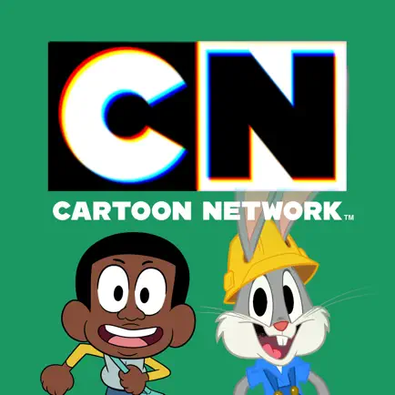
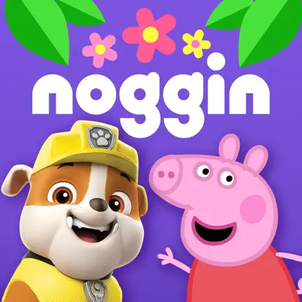

# Wahid Maruf - Mobile Developer

## Professional Summary

Experienced mobile developer with a strong foundation in iOS development and 1.5 years of hands-on experience with Flutter. Leveraging 5 years of iOS development expertise, I bring a deep understanding of mobile application architecture, design, and development lifecycle.

## Contact Information

- **Name:** Wahid Maruf
- **Email:** wahid.maruf@gmail.com
- **Phone:** +1-902-880-2455
- **Location:** Vancouver, Canada
- **LinkedIn:** [LinkedIn Profile](https://www.linkedin.com/in/wahid-maruf/)
- **GitHub:** [GitHub Profile](https://github.com/wahidmaruf)

## Published Apps

Here are some of the notable apps I have contributed to:

 

- **[Binance.US: Buy Bitcoin & ETH](https://apps.apple.com/us/app/binance-us-buy-bitcoin-eth/id1492670702)**

- **[Air Canada](https://apps.apple.com/ca/app/air-canada-aeroplan/id326459697)**

- **[Cartoon Network](https://apps.apple.com/us/app/cartoon-network-app/id404593641?platform=appleTV)**

- **[Noggin Preschool Learning App](https://apps.apple.com/us/app/noggin-preschool-learning-app/id932828299?platform=appleTV)**

## Personal Apps
My personal projects developed in flutter ([Source Code](https://github.com/wahidmaruf/wave_news)).
#### Wave News

Simple and intuitive news app provides you with the latest headlines from around the world, all at your fingertips.

## Skills

### Primary Skills:

- Flutter Framework
- Dart
- iOS development
- Agile

### Other Skills:

- Unit Testing
- Flutter DevTools
- Core Data, Realm
- Kotlin, Java
- Git, CI/CD, Jenkins, Bitrise
- Firebase, MySQL, Realm
- Object-Oriented Programming (OOP)
- SOLID & Design principles
- Clean Architecture

## Work History

### Binance.US – Mobile Developer
*Vancouver, BC · March 2023 – July 2023*

#### Responsibilities:

- Developed core functionalities for cryptocurrency trading, which included real-time price graph displays. Utilized Dart and Flutter, along with the fl_chart and web socket channel libraries.
- Designed and implemented a donation feature, enabling users to contribute cryptocurrencies to various organizations seamlessly. This feature utilized Restful APIs, Cubit for state management, and animations to ensure a smooth donation process.
- Implemented real-time updates for cryptocurrencies and watchlist items, ensuring users receive up-to-the-minute information using Dart WebSockets.
- Enabled users to explore available cryptocurrencies for staking orders and place orders using Restful APIs and Flutter animations.
- Conducted A/B testing initiatives to optimize user onboarding and engagement in a cryptocurrency app.
- Designed and coded variations of UI components, layouts, and features to test user preferences.
- Implemented search, pagination, authentication, deep links, internationalization, dark mode, and unit tests.
- Utilized Firebase A/B Testing, Firebase Remote Config, video_player, and mocktail for these features.

### IBM CANADA – Senior Mobile Developer
*Halifax, NS · August 2019 – February 2023*

#### Tech Stack
- **Frameworks**: Flutter, Dart, Swift, Swift UI, RxSwift, Core Animations, Cocoa Touch
- **Tools**: Jenkins, Firebase
- **Methodologies**: MVVM, Scrum, Agile
- **Testing**: Unit Testing, Accessibility

### Achievements and Responsibilities
- Implemented various features, including the dashboard screen, digital card, different partner offers, and transaction display and filtering.
- Demonstrated a strong ability to quickly learn new skills and applied them to daily tasks, resulting in improved efficiency and productivity.
- Elevated product quality through rigorous code reviews and collaborative efforts with QA teams to implement automation testing.
- Collaborated closely with designers to ensure that app designs adhered to design specifications, ensuring a seamless user experience.
- Championed a focus on quality by establishing clear guidelines, such as coding standards, project structure, and MVVM architecture, and led by example.
- Acted as a mentor and guide for other developers through regular meetings, pair programming sessions, and progress assessments.
- Actively participated in team-building exercises to enhance working relationships and foster a collaborative work environment.

## RedSpace – Mobile Developer
*Halifax, NS · December 2018 – July 2019*

### Technical Scope
- **Languages**: Swift
- **Frameworks/Tools**: tvOS, Coordinator pattern, PinLayout, RxSwift, Swinject, Jenkins, Video Player, Promise pattern, Firebase

### Achievements and Responsibilities
- Implemented various features, including a navigation bar and the ability to select and save multiple favorite shows on the start-up screen.
- Contributed to the development of an authentication framework and designed the User Interface for the authentication screen.
- Explored, experimented, and evaluated different solutions to address specific criteria and challenges.
- Effectively tracked projects using GIT and Jira for efficient project management.
- Successfully implemented a video player with player controls for enhanced user experience.
- Designed application screen flows using storyboards to create intuitive user journeys.
- Proposed and implemented solutions to better isolate business logic from the presentation layer, enhancing code maintainability.
- Collaborated with cross-functional teams to swiftly resolve problems and ensure project success.

## Education

- **Master of Science**
  - Degree: Computing & Data Analytics
  - Institution: Halifax, NS
  - Graduation Date: 05/2019

- **Bachelor of Science**
  - Degree: Computer Science
  - Institution: Rajshahi University of Engineering & Technology, Bangladesh
  - Graduation Date: 03/2016

## Certifications

- AWS Certified Cloud Practitioner
- Microsoft Certified: Azure Fundamentals
- IBM Cloud Advocate

## Residence Status

Permanent Residence
